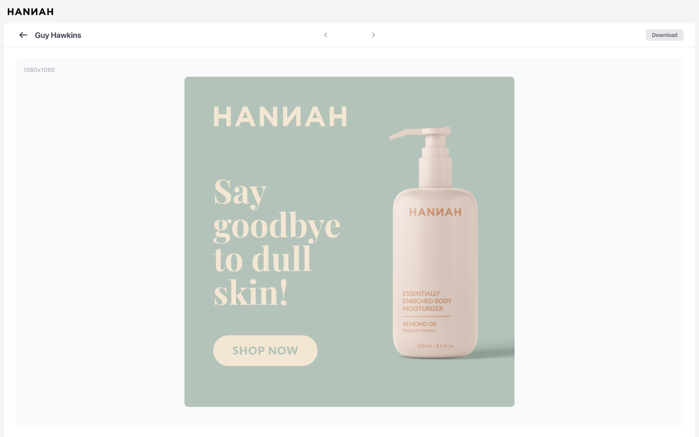

# Frontend developer task

## :page_facing_up: Welcome

Hi there 👋

We would like you to create a single-page application.
The goal of the task is to have an overview of your technical abilities and a common starting point for topics we will discuss during the technical interview. We recommend that you use all the best practices that you know of to showcase your strengths. Even if the application is small we would like you to structure and organise it in a way to be scalable.

## :joystick: Task brief

The app should use the following API: 
[Picsum](https://picsum.photos/)

Create a simple image gallery UI that allows users to:
- Browse the image gallery.
- Paginate the results (show 20 images per page).
- Show the current page number and the buttons to navigate to the next and previous pages.
- Clicking on an image opens the image details page where more image data is shown (author, sizes).
- The image details view has the ability to navigate to the next and previous image.
- When returning back from the details view, take the current photo into account and mark it in the gallery.

## :computer: Our tech stack
- [Vue.js](https://vuejs.org/) (Composition API, <script setup>)
- [TypeScript](https://www.typescriptlang.org/)
- [Pinia](https://pinia.vuejs.org/) for state management (Setup stores)
- [Vue Router](https://router.vuejs.org/)

Bonus points if you use the same stack. But feel free to use another framework like React or Angular if you’re more comfortable with it.

## :hammer_and_wrench: Other requirements
- Use a CSS preprocessor of your choice to style the app. Don't use a CSS framework since we would like to see your CSS coding skills as well.
- Follow the designs provided below as a guideline. No need to be pixel-perfect but try to match it as closely as possible.
- Feel free to use any fonts you see fit.
- Add some unit tests for components and store.
- Provide short instructions in the form of a README.md file on how to set up and run the app.
- Running in a Docker container is a plus.

## :rocket: Submission
- Clone this repository to your own Github before you start your task.
- When you're happy with the result send us the link or add us as collaborators if it's a private repository.

## :ocean: Designs

